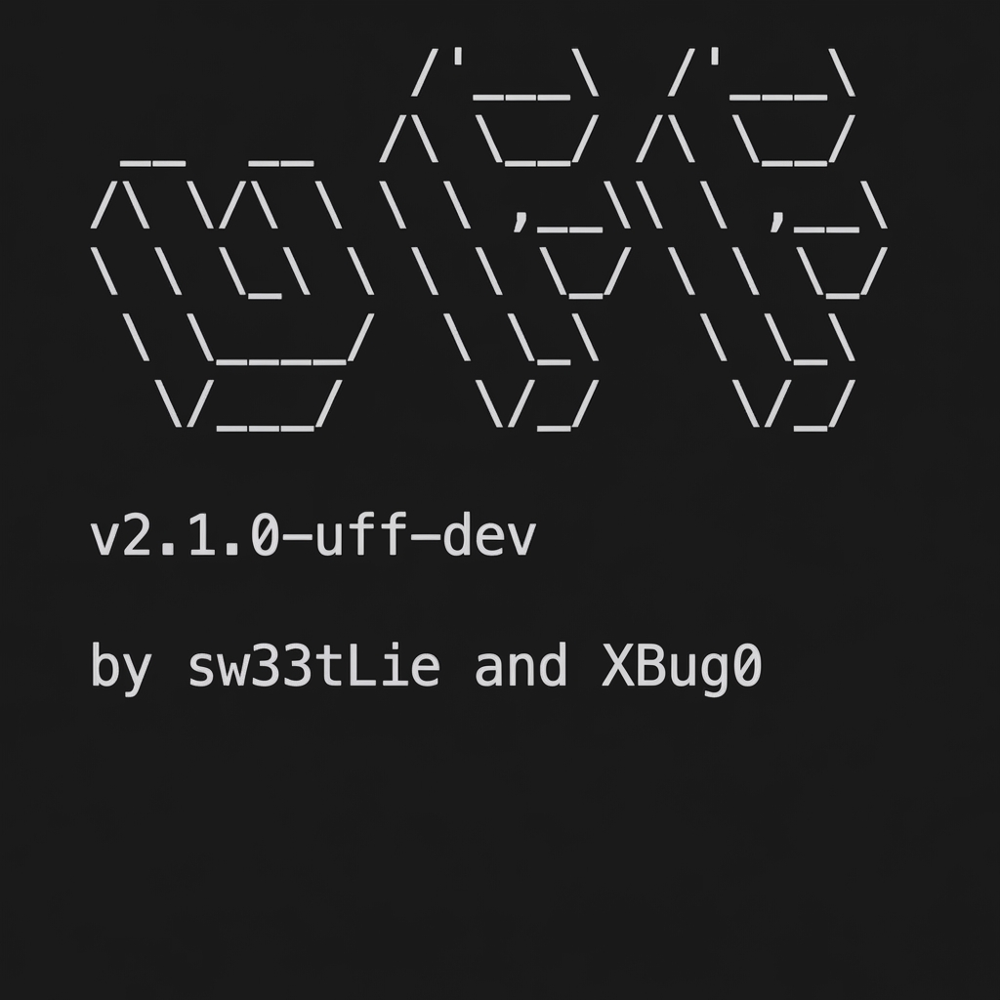

<h1 align="center">
  <br>
  <a href="https://github.com/Serdar715/uff">
    
  </a>
  <br>
  UFF
</h1>

<h4 align="center">The Advanced, High-Speed Web Fuzzer</h4>

<p align="center">
  <a href="#overview">Overview</a> •
  <a href="#features">Key Features</a> •
  <a href="#installation">Installation</a> •
  <a href="#usage-guide">Usage Guide</a> •
  <a href="#license">License</a>
</p>

<p align="center">
  
  
  
</p>

---

## Overview

**UFF** (formerly UFFX) is a next-generation web fuzzer built on top of the legendary `ffuf` engine. It extends the core capabilities with intelligent automation features designed for modern bug bounty hunting and security auditing.

While preserving the blazing speed of `ffuf`, **UFF** introduces **Auto-Fuzzing**, **Smart WAF Evasion**, **Heuristic Detection**, and **Mass Scanning** capabilities, making it a true "set and forget" tool.

## Key Features

| Feature | Flag | Description |
| :--- | :--- | :--- |
| **Auto-Fuzz** | `-auto` | Automatically parses URLs and injects payloads into all detected parameters. |
| **WAF Evasion** | `-autotune` | Detects rate-limiting (429/503) and automatically adjusts request rate to bypass WAFs. |
| **Smart LFI** | `-lfi` | Heuristic detection for Local File Inclusion (LFI) with false-positive reduction. |
| **Batch Mode** | `-batch` | Process thousands of URLs from a file or stdin seamlessly. |
| **DNS Enum** | `-dns` | Perform sub-domain resolution and DNS record discovery. |
| **Adv. Range** | `-range` | Generate complex sequences (Int, Hex, Date) without external wordlists. |
| **Spidering** | `-spider` | Built-in crawler to discover new endpoints and expand attack surface. |
| **Backup Scan** | `-db` | Automatically checks for backup files (.bak, .old, etc.) for every found file. |

## Installation

### From Source (Recommended)
Requires **Go 1.21+**

```bash
git clone https://github.com/Serdar715/uffx
cd uffx
go build -o uff .
# Move to your path (Optional)
sudo mv uff /usr/local/bin/
```

### Verification
Ensure the installation was successful:

```bash
uff -h
```

## Usage Guide

### 1. Auto-Fuzzing (Zero Configuration)
The most powerful feature of **UFF**. Provide a parameterized URL, and let the tool do the work.

```bash
# Basic Auto-Fuzz
uff -auto "http://target.com/vuln.php?id=1&page=intro&user=guest" -w wordlist.txt
```
**What happens?**
1. **UFF** parses queries: `id`, `page`, and `user`.
2. It creates 3 separate scan jobs, fuzzing each parameter individually.
3. WAF Evasion and Smart Detection are enabled automatically.

---

### 2. DNS Enumeration
Discover subdomains or check for DNS records before attacking.

```bash
# Subdomain Discovery
uff -u "http://target.com" -w subdomains.txt -dns
```

---

### 3. Advanced Range Input
Generate inputs dynamically without massive wordlists.

```bash
# Integer Range (Iterate IDs 1 to 10000)
uff -u "http://target.com/profile?id=FUZZ" -range 1-10000

# Hexadecimal Range (Iterate 0x00 to 0xFF)
uff -u "http://target.com/api/byte?val=0xFUZZ" -range 00-FF

# Date Range (Iterate dates)
uff -u "http://target.com/logs/FUZZ.log" -range 01-01-2023..31-12-2023
```

---

### 4. Mass Scanning (Batch Mode)
Pipe URLs from tools like `gau`, `waybackurls`, or `subfinder`.

```bash
# Scan a list of targets for 'admin' directory
cat live_subdomains.txt | uff -batch -w wordlist.txt -u FUZZ/admin

# Scan specific endpoints from a file
uff -l targets_with_params.txt -w payloads.txt -auto
```

---

### 5. Smart LFI Detection
Enable the heuristic engine to find Local File Inclusion vulnerabilities with high confidence.

```bash
uff -u "https://target.com/image?load=FUZZ" -w lfi_payloads.txt -lfi
```
*Note: This mode checks for response patterns like `root:x:0:0` to confirm vulnerabilities.*

---

### 6. WAF Evasion (Auto-Tune)
Avoid getting IP-banned during aggressive scans.

```bash
uff -u https://target.com/FUZZ -w large_wordlist.txt -autotune
```
*If a 429 Too Many Requests is detected, **UFF** parses the `Retry-After` header (or uses a default backoff), pauses, and slowly resumes.*

---

### 7. Backup File Discovery
Automatically finding backup files is crucial for exposing source code.

```bash
uff -u "http://target.com/FUZZ" -w wordlist.txt -db
```
*Effect*: If `index.php` is found, **UFF** immediately checks for `index.php.bak`, `index.php~`, `index.php.old`, etc.

## License

**UFF** is released under the MIT License. See [LICENSE](LICENSE) for details.

## Credits

- **Core Engine**: [ffuf](https://github.com/ffuf/ffuf) by joohoi
- **Original Fork**: [uff](https://github.com/sw33tLie/uff) by sw33tLie
- **Advanced Features**: Developed by [Serdar715](https://github.com/Serdar715)
